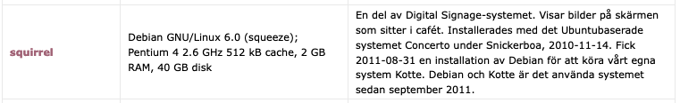

# Squirrel

Old Café computer that lives in the ceiling above the bar. Hasn't been in use for many years. Runs Debian 9, configured in kiosk mode. The password has been reset and is in syspass.

Squirrel uses a window managed called [Ratpoison](https://www.nongnu.org/ratpoison/)

If you try to use it, beware that the keyboard slightly broken.

Does not boot Arch.

Does boot alpine however. 