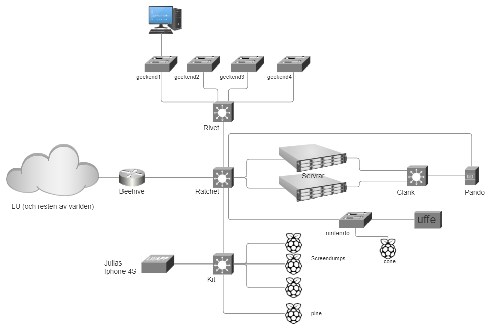

# Nätverk

Här sammanställs all info kring nätverken i våra sektionslokaler.

## Översikt

Nedan återfinns ett diagram över hur vårt nätverk ser ut i dagsläget. (mer exakt kommer det se ut såhär efter beehive är installerad, just nu kör vi med hyacinth som router)   Bilden är gjort med smartdraw och det ligger en fil uppladdad under assets här på wikin som man kan importera där och uppdatera. Det är en fett wonky lösning men plant UML skapar inga fina diagram :(